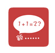

Bmob案例展示
==============

我们收集了一部分开发者做的比较好的案例放在这里，如果你有做的不错的案例想申请加入的话，可以联系我们。Email：heshaoyue@bmob.cn

## Beta Puppy

【应用介绍】There is a puppy named Beta, who is small, cute and smart. Beta’s master love it very much, so does Beta. One day, a baddy takes Beta away… What will happen?

【下载地址】[https://itunes.apple.com/app/id898185912](https://itunes.apple.com/app/id898185912)

## Circle圈子

【应用介绍】首个专属于WPers的社交APP，
秉承WP设计精髓，触于指尖、悦于心；
独特LiveSight和地图模式，圈住你我，
让你轻松发现身边的WPers！
从此，
你的坚守不再是一个人！
我们有相同的选择，没有理由不一起分享。
This is Circle，Circling Every WPer！

【下载地址】[http://www.windowsphone.com/zh-cn/store/app/circle圈子/5f05b00d-31fb-4429-a948-87d01f477110](http://www.windowsphone.com/zh-cn/store/app/circle圈子/5f05b00d-31fb-4429-a948-87d01f477110)

## 闹钟one（豌豆荚设计奖·第87期）

【应用介绍】整合闹钟one的经典设计和即时提醒2.0的强大功能，闹钟one³是迄今为止最优雅的闹钟。闹钟one将闹钟、定时器、日历及日程活动提醒整合在同一个应用中，并以时间顺序显示在同一个时间轴中，滑动屏幕即可了解您一整天的时间安排. 

【下载地址】[http://www.wandoujia.com/apps/com.nextdev.alarm](http://www.wandoujia.com/apps/com.nextdev.alarm)

## easytouch

【应用介绍】EasyTouch是一款轻松让您单手管理手机的快捷软件，可完美代替物理键，独特的区域截屏，无需root就能使用虚拟返回键功能，即使锁屏的时候也可以让您随意开关手电筒，数据流量、声音、wifi等控制手机功能 (快捷菜单)，让您在使用任何软件的时候随意切换软件（最近使用），随时打开您想要打开的软件 (悬浮窗->常用)，让您在游戏中一键截图(需要ROOT权限) ，让您在游戏卡的时候清出内存，让您手机更加流畅(内存清理)，菜单键需要ROOT权限。

【下载地址】[https://play.google.com/store/apps/details?id=com.shere.easytouch.holo](https://play.google.com/store/apps/details?id=com.shere.easytouch.holo)

## 你猜啊

【应用介绍】 “你猜啊”不仅仅是一款简单的猜图游戏，它还是一款极具挑战性的问答游戏，一个小百科，给你全方位的脑补，最强大脑什么的在它面前根本不值一提，除非你已经超越了这个等级。游戏中还设有等级规则，让你体验从凡人到神的成就感！

【下载地址】 [http://zhushou.360.cn/detail/index/soft_id/1874241?recrefer=SE_D_你猜啊](http://zhushou.360.cn/detail/index/soft_id/1874241?recrefer=SE_D_你猜啊)

## 儿童手工坊

【应用介绍】儿童手工坊，是款教小朋友们怎么独立生活的小游戏！里面有4个小游戏吃得快，玩具屋，购物单，点果果都是很Q的小游戏，卡通画面相信小朋友一定喜欢！

【下载地址】[http://shouji.baidu.com/game/item?docid=6864181&from=as&f=search_app_%E5%84%BF%E7%AB%A5%E6%89%8B%E5%](http://shouji.baidu.com/game/item?docid=6864181&from=as&f=search_app_%E5%84%BF%E7%AB%A5%E6%89%8B%E5%)

## 变声神器-最强变声工具

【应用介绍】史上最强变声工具！自由调节变声参数！
变男变女变老变小，随心所欲，百变无穷。
一键分享至微信及各大社交平台，方便快捷。

【下载地址】[https://itunes.apple.com/us/app/bian-sheng-shen-qi-zui-qiang/id910445286?l=zh&ls=1&mt=8](https://itunes.apple.com/us/app/bian-sheng-shen-qi-zui-qiang/id910445286?l=zh&ls=1&mt=8)

## 俄罗斯方块

【应用介绍】史上最经典的休闲、益智游戏俄罗斯方块来啦！。广受欢迎的经典单机俄罗斯方块最新作终于登场了！把方块连成直线一口气消除！作为方块游戏爱好者的您绝不能错过。十个人里有七个在玩，再不下载你就要OUT啦！新增微博和微信分享功能，和你的朋友圈一起High！上下班、旅途、课间、坐马桶、有点时间就能玩儿，好稀饭咧。
史上最經典的休閒、益智遊戲俄羅斯方塊來啦！ 。廣受歡迎的經典單機俄羅斯方塊最新作終於登場了
特色：
+ 精致的游戏设计和精湛的效果 !
+ 穿透方块穿过障碍!
+ 微博分享和微信分享功能
+ 超级耐玩!
+ 无限连击.
+ 虚拟键盘操作.
+ 手势操作.
+ 自动储存....

【下载地址】[http://shouji.baidu.com/game/item?docid=6883602&from=as](http://shouji.baidu.com/game/item?docid=6883602&from=as)

## V2EX Club

【应用介绍】V2EX Club是V2EX的苹果客户端，提升了网页版的用户体验，将苹果的推送功能与之完美结合，小伙伴们再也不用担心错过V2EX的精采文章。

【下载地址】[https://itunes.apple.com/us/app/v2ex-club/id883141469?mt=8](https://itunes.apple.com/us/app/v2ex-club/id883141469?mt=8)

## 别踩白块儿

【应用介绍】这是一个精神游戏，指尖儿飞舞，在这里你是一位音乐大师，可以是一位生活禅者，也可以是一位激情演奏家，我们只给你黑白两块儿，踩下黑块儿，别踩白块儿，在你下班疲累时，黑白的世界，纯净的音乐，消除你一天的烦忧，洗涤心灵，开启一段神秘之旅，别忘了与好友一起pk看看谁能走更远哦！

【下载地址】[http://zhushou.360.cn/detail/index/soft_id/1655186](http://zhushou.360.cn/detail/index/soft_id/1655186)

## 泡泡龙:驯龙高手

【应用介绍】经典的泡泡龙游戏，增加前所未有的BOSS战，紧张刺激，值得一玩。

游戏是以传统的泡泡龙射击为主,延续经典泡泡龙的主要玩法的同时独创了非常独特的挑战BOSS关卡。 

【下载地址】[https://itunes.apple.com/cn/app/bubble-gaga2/id900451922?mt=8](https://itunes.apple.com/cn/app/bubble-gaga2/id900451922?mt=8)

## ZNG Life

【应用介绍】想跟著力恩君及香蕉先生一起讓日生活更繽紛可愛嗎?ZNG Life是一款充滿手繪風格的app,可以讓照片變得像是隨身的日記本，紀錄生活中每一個重點時刻！配合上許多可愛有趣的物件貼圖及相框，讓你的照片馬上更加豐富多姿。盡情的發揮創造力吧！完成屬於自己的作品，並跟大家一起分享！專屬於你的照片手札已經打開等待著你來完成它！趕快來下載回去呦！！ 

【下载地址】[https://itunes.apple.com/cn/app/zng-life/id721780792?mt=8](https://itunes.apple.com/cn/app/zng-life/id721780792?mt=8)

## 盒子 for LOL - 联盟 助手 战斗力

【应用介绍】完美支持多玩LOL盒子的查询功能!

更有全新首胜提醒功能,最娱乐的视频,最精彩的比赛,最专业的解说,最前沿的攻略!  

【下载地址】[https://itunes.apple.com/cn/app/he-zi-for-lol/id691120025?mt=8](https://itunes.apple.com/cn/app/he-zi-for-lol/id691120025?mt=8)

## Flower Legend

【应用介绍】Flower Legend is a fun puzzle match-3 game full of love.Come to defeat the evil witch and rescue Vura then make the word full of chrysanthemums! Explore the unknown lands by completing levels!Switch and match your way in this joyful and addictive puzzle adventure. Come on, let's start the joyful saga alone or play with friends to see who can create the dream world! 

【下载地址】[https://itunes.apple.com/us/app/tian-tian-ai-ju-hua/id793373055?ls=1&mt=8](https://itunes.apple.com/us/app/tian-tian-ai-ju-hua/id793373055?ls=1&mt=8)

## 阿3正传-Threes免费中文加强版！

【应用介绍】这是一款益智小游戏，规则是把方块合并，合并的办法是其中一个数字靠边的时候，将另一个数字向四个方向的墙推过去。1和2可以合并成3，3以后，就能只能是相同的数字合并了，比如3和3合并成6、6和6合并成12。当方块占满屏幕，而且也无法再进行组合时游戏结束，游戏结束后会根据你的完成情况进行评分。 

【下载地址】[https://itunes.apple.com/cn/app/a3zheng-chuan-threes-mian/id824756631?mt=8](https://itunes.apple.com/cn/app/a3zheng-chuan-threes-mian/id824756631?mt=8)

## 萌宠总动员（新派消除RPG）

【应用介绍】年度最治愈益智轻手游《萌宠总动员》萌动来袭，求合体玩法的童话版“勇者斗恶龙"。
《萌宠总动员》为你献上幽默治愈的纯真剧情，开启指尖上的童话嘉年华！魔龙觉醒，矢志不渝地履行囚禁公主的义务，勇者(熊孩子)为营救公主再次上路。途中他将遭遇各色小怪兽，结识萌宠小伙伴，收获信任、友情与感动。如此精彩旅程你怎能错过？ 

【下载地址】[https://itunes.apple.com/us/app/meng-chong-zong-dong-yuan/id882707772?mt=8#](https://itunes.apple.com/us/app/meng-chong-zong-dong-yuan/id882707772?mt=8#)

## 豆豆菜谱

【应用介绍】一款菜谱类应用，您可以方便的学到很多菜的做法，内容齐全，可以通过关键字查到你想要的菜谱，各式各样的都有，是您生洛的好邦手。 

【下载地址】[http://zhushou.360.cn/detail/index/soft_id/1643386#prev](http://zhushou.360.cn/detail/index/soft_id/1643386#prev)

## 新概念英语

【应用介绍】《新概念英语》安卓应用系列震撼推出啦！包含新概念1-4全册有声英语教程：课文双语对照、音频文本 同步播放、权威详解、课后练习配套辅导。 
作为英语学习敲门砖的第一册，到体味英语精髓的第四册，轻轻松松从英语零基础直达大学六级水平！  

【下载地址】[http://app.mi.com/detail/56026](http://app.mi.com/detail/56026)

## 戒撸吧

【应用介绍】如果说毒品是上流人士放纵的奢侈品，那么色情就是无知大众堕落的日用品！
《戒撸吧》是一个色瘾患者的恢复与交流平台，我们的理念是传播正能量！ 

【下载地址】[http://www.wandoujia.com/apps/com.quwei.jieseba](http://www.wandoujia.com/apps/com.quwei.jieseba)

## 陌邻

【应用介绍】陌邻是一款基于小区人的交友应用，让小区交友变得简单，旨以实现移动互联网小区人的创新交流与互动。 
陌邻可随时发现小区有意思的生活动态，即时分享小区见闻，寻找志趣相投的陌邻，交流、相互帮助，让陌邻变睦邻。

【下载地址】[http://app.mi.com/detail/74391](http://app.mi.com/detail/74391)

## 天天计步器

【应用介绍】1.迄今为止最简单温馨的个人计步器。 
2.优化了的计步算法，能更准确的记录你的步数和行走距离。 
3.用户可自定义步长，体重，运动模式等，最大可能的满足不同用户的差异性。 
4.内置百度地图，可以随时查看自己所处的位置。 
5.设置每次行走目标,激励自己完成目标。 
6.温馨的天气提示，实时获取本地天气情况。 
7.每日一句，中英对比，运动学习两不误。 
8.贴心的农历显示,让你不在刻意去翻日历。 
9.可设置开始页背景图片,和ta一起锻炼吧。 
10.历史记录和位置分享。 
12.电池温度和电量显示。 
13.一键播放音乐(目前支持QQ音乐，天天动听，酷狗音乐和酷我音乐)。 
14.随时计算身体脂肪消耗量。

【下载地址】[http://app.mi.com/detail/67695](http://app.mi.com/detail/67695)

## 算你狠Math

【Bmob点评】这款游戏的下载量虽然不高，但我们测试之后，觉得画面制作比较精致，关卡设计还是很吸引人的，对于个人开发者而言，很赞~~

【应用介绍】这是一款简单到令人发指却又容易上瘾的算术虐心游戏,请慎入.内置全球排行榜,让您与小伙伴们一较高下,您也可以把游戏截图发给好友炫耀一下,看什么才叫真正的"算你狠”。

【下载地址】[http://zhushou.360.cn/detail/index/soft_id/1974271?recrefer=SE_D_%E7%AE%97%E4%BD%A0%E7%8B%A0#prev](http://zhushou.360.cn/detail/index/soft_id/1974271?recrefer=SE_D_%E7%AE%97%E4%BD%A0%E7%8B%A0#prev)